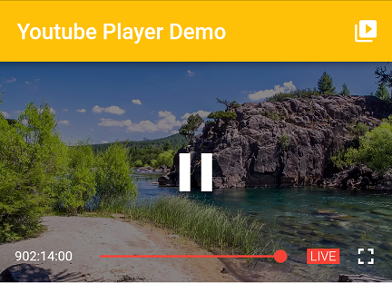

# Youtube Player for Flutter

[](https://pub.dartlang.org/packages/youtube_player_flutter)
[](https://travis-ci.org/sarbagyastha/youtube_player_flutter)
[](https://github.com/sarbagyastha/youtube_player_flutter/blob/master/LICENSE)
[](https://github.com/sarbagyastha/youtube_player_flutter/raw/master/ytpf_demo32.apk)
[](https://github.com/sarbagyastha/youtube_player_flutter/raw/master/ytpf_demo64.apk)

Flutter plugin for playing or streaming YouTube videos inline using the
official
[**iFrame Player API**](https://developers.google.com/youtube/iframe_api_reference).
Supports both **Android** and **iOS** platforms.

 

## Salient Features
* Inline Playback
* No need for API Key
* Supports custom controls
* Supports Live Stream videos
* Supports changing playback rate
* Support for both Android and iOS
* Adapts to quality as per the bandwidth
* Fast Forward and Rewind on horizontal drag

The plugin uses [webview_flutter](https://pub.dartlang.org/packages/webview_flutter) under-the-hood to play videos. 

Since *webview_flutter* relies on Flutter's new mechanism for embedding Android and iOS views, this plugin might share some known issues tagged with the [platform-views](https://github.com/flutter/flutter/labels/a%3A%20platform-views) and/or [webview](https://github.com/flutter/flutter/labels/p%3A%20webview) labels.


## Setup

### iOS
Opt-in to the embedded views preview by adding a boolean property to the app's `Info.plist` file
with the key `io.flutter.embedded_views_preview` and the value `YES`.

### Android
No configuration required - the plugin should work out of the box.


#### Using Youtube Player
         
```dart
YoutubePlayer(
    context: context,
    videoId: "iLnmTe5Q2Qw",
    flags: YoutubePlayerFlags(
      autoPlay: true,
      showVideoProgressIndicator: true,
    ),
    videoProgressIndicatorColor: Colors.amber,
    progressColors: ProgressColors(
      playedColor: Colors.amber,
      handleColor: Colors.amberAccent,
    ),
    onPlayerInitialized: (controller) {
      _controller = controller;
      _controller.addListener(listener);
    },
),
```
         
#### Playing live stream videos
Set the isLive property to true in order to change the UI to match Live Video.

 

```dart
YoutubePlayer(
    context: context,
    videoId: "iLnmTe5Q2Qw",
    flags: YoutubePLayerFlags(
      isLive: true,
    ),
    liveUIColor: Colors.amber,
),
```

## Want to customize the player?
 With v5.x.x and up, use the `topActions` and `bottomActions` properties to customize the player.

 Some of the widgets bundled with the plugin are:
 * FullScreenButton
 * TotalDuration
 * CurrentPosition
 * PlayButton
 * PlaybackSpeedButton
 * ProgressBar

```dart
YoutubePlayer(
    context: context,
    videoId: "iLnmTe5Q2Qw",
    bottomActions: [
      CurrentPosition(),
      ProgressBar(isExpanded: true),
      TotalDuration(),
    ],
),
```

## Didn't like the controls at all?
Don't worry, Got a solution for you. :wink:

Set the hideControls property to true, then you can create your own custom controls using the controller obtained from onPlayerInitialized property.

```dart
YoutubePlayer(
    context: context,
    videoId: "iLnmTe5Q2Qw",
    flags: YoutubePlayerFlags(
      hideControls: true,
    ),
    onPlayerInitialized: (controller) {
      //Create your own UI using this controller
      //on top of the player.
    },
),
```

## Want to play using Youtube URLs ? 
The plugin also provides `convertUrlToId()` method that converts youtube links to its corresponding video ids.
```dart
String videoId;
videoId = YoutubePlayer.convertUrlToId("https://www.youtube.com/watch?v=BBAyRBTfsOU");
print(videoId); // BBAyRBTfsOU
```

## Example

[More Detailed Example](https://github.com/sarbagyastha/youtube_player_flutter/tree/master/example)

## Note
Know more about the configuration options [here](https://pub.dartlang.org/documentation/youtube_player_flutter/latest/youtube_player_flutter/youtube_player_flutter-library.html).

## Download
Download apks from above(in badges) and try the plugin.

## Limitation 
Since the plugin is based on platform views. This plugin requires Android API level 20 or greater.

If you only want to target Android and need support for Android Kitkat or less, then you can use [youtube_player](https://pub.dartlang.org/packages/youtube_player).  

## License

```
Copyright (c) 2019 Sarbagya Dhaubanjar

Permission is hereby granted, free of charge, to any person obtaining a copy
of this software and associated documentation files (the "Software"), to deal
in the Software without restriction, including without limitation the rights
to use, copy, modify, merge, publish, distribute, sublicense, and/or sell
copies of the Software, and to permit persons to whom the Software is
furnished to do so, subject to the following conditions:

The above copyright notice and this permission notice shall be included in all
copies or substantial portions of the Software.

THE SOFTWARE IS PROVIDED "AS IS", WITHOUT WARRANTY OF ANY KIND, EXPRESS OR
IMPLIED, INCLUDING BUT NOT LIMITED TO THE WARRANTIES OF MERCHANTABILITY,
FITNESS FOR A PARTICULAR PURPOSE AND NONINFRINGEMENT. IN NO EVENT SHALL THE
AUTHORS OR COPYRIGHT HOLDERS BE LIABLE FOR ANY CLAIM, DAMAGES OR OTHER
LIABILITY, WHETHER IN AN ACTION OF CONTRACT, TORT OR OTHERWISE, ARISING FROM,
OUT OF OR IN CONNECTION WITH THE SOFTWARE OR THE USE OR OTHER DEALINGS IN THE
SOFTWARE.
```