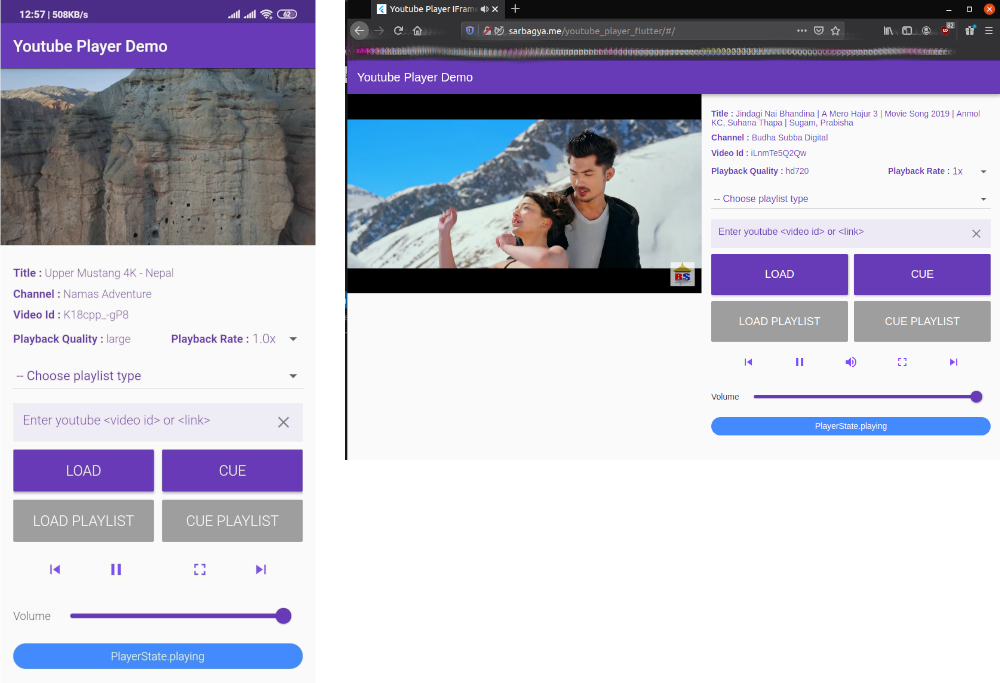

# Youtube Player IFrame

[](https://pub.dartlang.org/packages/youtube_player_iframe)
[](https://github.com/sarbagyastha/youtube_player_flutter/blob/master/LICENSE)
[](https://github.com/sarbagyastha/youtube_player_flutter/releases)
[](https://github.com/sarbagyastha/youtube_player_flutter)
[](https://github.com/sarbagyastha/youtube_player_flutter)
[](https://dart.dev/guides/language/effective-dart)
[](https://sarbagyastha.github.io/youtube_player_flutter)

Flutter plugin for playing or streaming YouTube videos inline using the official [**iFrame Player API**](https://developers.google.com/youtube/iframe_api_reference).
The package exposes almost all the API provided by **iFrame Player API**. So, it's 100% customizable.

Note: This package only provides default youtube web player's skin. If you need Youtube Android player like player with gesture support, use [youtube_player_flutter](https://pub.dartlang.org/packages/youtube_player_flutter) instead.
`youtube_player_flutter` also uses this package as dependency. (Migration Pending)

Supported Platforms:
- **Android** 
- **iOS**
- **Web**



[Click here for WEB DEMO](https://sarbagyastha.github.io/youtube_player_flutter)

## Salient Features
* Inline Playback
* Supports captions
* No need for API Key
* Supports custom controls
* Retrieves video meta data
* Supports Live Stream videos
* Supports changing playback rate
* Support for both Android and iOS
* Adapts to quality as per the bandwidth
* Exposes builders for building custom controls
* Playlist Support (Both custom and Youtube's playlist)


For Web, Flutter's [HtmlElementView](https://api.flutter.dev/flutter/widgets/HtmlElementView-class.html).
For Android & iOS, the package uses [flutter_inappwebview](https://pub.dartlang.org/packages/flutter_inappwebview) under-the-hood.

Since *flutter_inappwebview* relies on Flutter's mechanism for embedding Android and iOS views, this plugin might share some known issues tagged with the [platform-views](https://github.com/flutter/flutter/labels/a%3A%20platform-views) label.

## Requirements
* **Android**: `minSdkVersion 17` and add support for `androidx` (see [AndroidX Migration](https://flutter.dev/docs/development/androidx-migration))
* **iOS**: `--ios-language swift`, Xcode version `>= 11`
* **Web**: None

## Setup

### Web
No Configuration Required.

### iOS
No Configuration Required.

[Follow the guide here for complete iOS setup](https://pub.dev/packages/flutter_inappwebview#important-note-for-ios)

### Android
Set `minSdkVersion` of your `android/app/build.gradle` file to at least 17.

[Follow the guide here for complete Android setup](https://pub.dev/packages/flutter_inappwebview#important-note-for-android)

*Note:* Although the minimum to be set is 17, the player won't play on device with API < 20. 
For API < 20 devices, you might want to forward the video to be played using YouTube app instead, using packages like `url_launcher` or `android_intent`.

#### Using the player

```dart
YoutubePlayerController _controller = YoutubePlayerController(
    initialVideoId: 'K18cpp_-gP8',
    params: YoutubePlayerParams(
        playlist: ['nPt8bK2gbaU', 'gQDByCdjUXw'], // Defining custom playlist
        startAt: Duration(seconds: 30),
        showControls: true,
        showFullscreenButton: true,
    ),
);

YoutubePlayerIFrame(
    controller: _controller,
    aspectRatio: 16 / 9,
),

-------------- OR --------------

YoutubePlayerControllerProvider( // Provides controller to all the widget below it.
  controller: _controller,
  child: YoutubePlayerIFrame(
    aspectRatio: 16 / 9,
  ),
);

// Access the controller as: `YoutubePlayerControllerProvider.of(context)` or `controller.ytController`.
```

## Want to customize the player?
The package provides `YoutubeValueBuilder`, which can be used to create any custom controls.

For example, let's create a custom play pause button.
```dart
YoutubeValueBuilder(
   controller: _controller, // This can be omitted, if using `YoutubePlayerControllerProvider`
   builder: (context, value) {
      return IconButton(
         icon: Icon( 
                  value.playerState == PlayerState.playing
                    ? Icons.pause
                    : Icons.play_arrow,
         ),
         onPressed: value.isReady
            ? () {
                  value.playerState == PlayerState.playing
                    ? context.ytController.pause()
                    : context.ytController.play();
                 }
            : null,
      );
   },
);
```

## Available Methods
Methods available for `YoutubePlayerController`.

Method                                              | Description
------------                                        | ---------------
play()                                              | Plays the currently cued/loaded video.
pause()                                             | Pauses the currently playing video.
stop()                                              | Stops and cancels loading of the current video.
nextVideo()                                         | Loads and plays the next video in the playlist.
previousVideo()                                     | Loads and plays the previous video in the playlist.
playVideoAt(index)                                  | Loads and plays the specified video in the playlist.
load(videoId, {startAt, endAt})                     | Loads and plays the specified video.
cue(videoId, {startAt, endAt})                      | Loads the specified video's thumbnail and prepares the player to play the video.
loadPlaylist(list, {listType, startAt, index})      | Loads the specified list and plays it.
cuePlaylist(list, {listType, startAt, index})       | Queues the specified list of videos.
mute()                                              | Mutes the player.
unMute()                                            | Unmutes the player.
setVolume(volume)                                   | Sets the volume of player.
seekTo(position, {allowSeekAhead})                  | Seeks to a specified time in the video.
setSize(size)                                       | Sets the size in pixels of the player.
setPlaybackRate(rate)                               | Sets the playback speed for the video.
setLoop(loop)                                       | Enables or disables looping.
setShuffle(shuffle)                                 | Enables or disables shuffling playlist.
reset()                                             | Resets the controller.
convertUrlToId(url, {trimWhiteSpaces})              | Converts fully qualified YouTube Url to video id.
getThumbnail(videoId, {quality, webp})              | Grabs YouTube video's thumbnail for provided video id.
onEnterFullScreen()                                 | Called when player enters fullscreen.
onExitFullScreen()                                  | Called when player exits fullscreen.
invokeJavascript(function)                          | Invoke custom javascript function.
hideTopMenu()                                       | Hides the title and share icons at the top of player (_May violate YouTube's TOS. Use at your own risk._)
hidePauseOverlay()                                  | Hides the related videos overlay while player is paused (_May violate YouTube's TOS. Use at your own risk._)

## Youtube Player Parameters
All the available parameters.

Parameter                  | Description
------------               | ---------------
autoPlay                   | Specifies whether the initial video will automatically start to play when the player loads. **Default = true**
mute                       | Mutes the player. **Default = false**
captionLanguage            | Caption language. **Default = 'en'**
enableCaption              | Enables caption by default. **Default = true**
color                      | Specifies the color that will be used in the player's video progress bar to highlight the amount of the video that the viewer has already seen. **Default = red**
showControls               | Indicates whether the video player controls are displayed. **Default = true**
enableKeyboard             | Enables or disables the player to respond to keyboard controls. **Default = false**
enableJavaScript           | Enables or disables the player to be controlled via IFrame or JavaScript Player API calls. **Default = true**
endAt                      | Ends the playback in specified time.
showFullscreenButton       | Shows or hides the fullscreen button from displaying in the player. **Default = false**
interfaceLanguage          | Sets the player's interface language.
showVideoAnnotations       | Enables or disables video annotations to be shown by default. **Default = true**
loop                       | Enables or disables the player to play the initial video again and again. **Default = true**
playlist                   | Specifies a list of video IDs to be played after initialVideoId.
playsInline                | Controls whether videos play inline or fullscreen in an HTML5 player on iOS. **Default = true**
strictRelatedVideos        | Enabling ensure that related videos will come from the same channel as the video that was just played. **Default = false**
startAt                    | Starts the video at specified time.
desktopMode                | The controls will be alike Youtube Desktop's controls.


## Limitation 
For Android: Since the plugin is based on platform views. This plugin requires Android API level 20 or greater.

## License
```
Copyright 2020 Sarbagya Dhaubanjar. All rights reserved.

Redistribution and use in source and binary forms, with or without modification,
are permitted provided that the following conditions are met:

    * Redistributions of source code must retain the above copyright
      notice, this list of conditions and the following disclaimer.
    * Redistributions in binary form must reproduce the above
      copyright notice, this list of conditions and the following
      disclaimer in the documentation and/or other materials provided
      with the distribution.
    * Neither the name of Google Inc. nor the names of its
      contributors may be used to endorse or promote products derived
      from this software without specific prior written permission.

THIS SOFTWARE IS PROVIDED BY THE COPYRIGHT HOLDERS AND CONTRIBUTORS "AS IS" AND
ANY EXPRESS OR IMPLIED WARRANTIES, INCLUDING, BUT NOT LIMITED TO, THE IMPLIED
WARRANTIES OF MERCHANTABILITY AND FITNESS FOR A PARTICULAR PURPOSE ARE
DISCLAIMED. IN NO EVENT SHALL THE COPYRIGHT OWNER OR CONTRIBUTORS BE LIABLE FOR
ANY DIRECT, INDIRECT, INCIDENTAL, SPECIAL, EXEMPLARY, OR CONSEQUENTIAL DAMAGES
(INCLUDING, BUT NOT LIMITED TO, PROCUREMENT OF SUBSTITUTE GOODS OR SERVICES;
LOSS OF USE, DATA, OR PROFITS; OR BUSINESS INTERRUPTION) HOWEVER CAUSED AND ON
ANY THEORY OF LIABILITY, WHETHER IN CONTRACT, STRICT LIABILITY, OR TORT
(INCLUDING NEGLIGENCE OR OTHERWISE) ARISING IN ANY WAY OUT OF THE USE OF THIS
SOFTWARE, EVEN IF ADVISED OF THE POSSIBILITY OF SUCH DAMAGE.